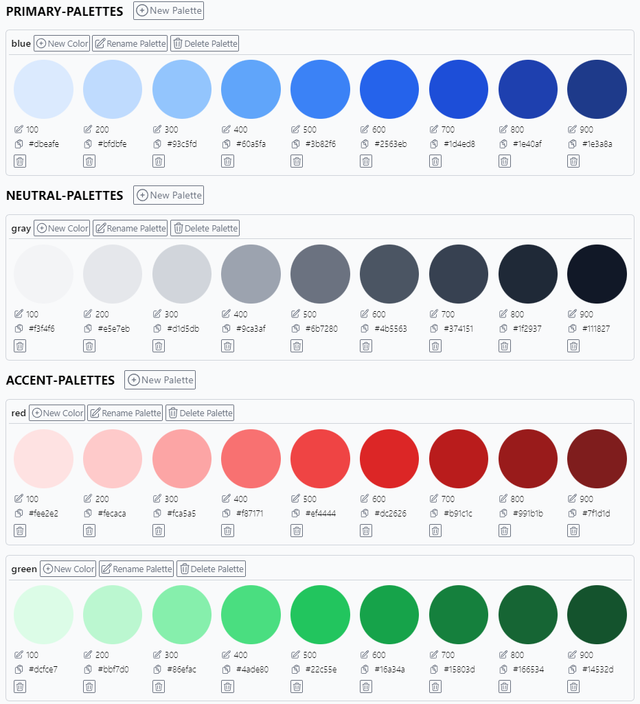
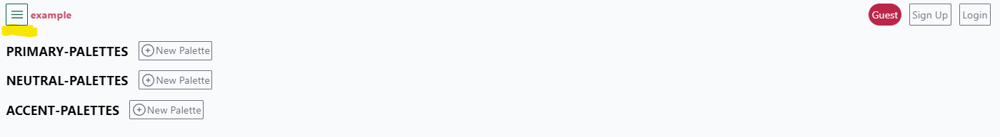
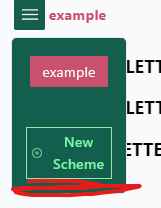

  

  <h1 align="center">Scheme Bank</h1>

  

  Simply save your colors.

Scheme bank was inspired by [Refactoring UI's Building Your Color Palette.](https://www.refactoringui.com/previews/building-your-color-palette)

## Usage

### Create a new scheme

Click on the menu to see the button for creating new schemes.

## Built With

- <a href="https://vitejs.dev"> Vite</a>
- <a href="https://vitejs.dev"> React</a>
- <a href="https://vitejs.dev"> Firebase</a>
- <a href="https://vitejs.dev"> React Query</a>
- <a href="https://vitejs.dev"> Tailwind CSS</a>
- **<a href="http://casesandberg.github.io/react-color/">React Color</a>**
